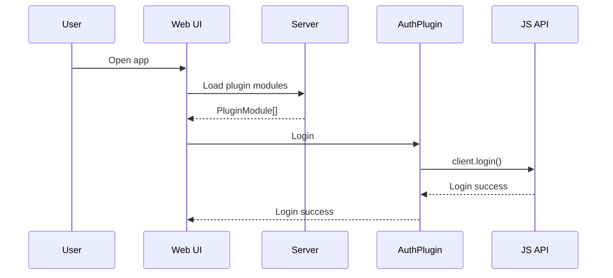
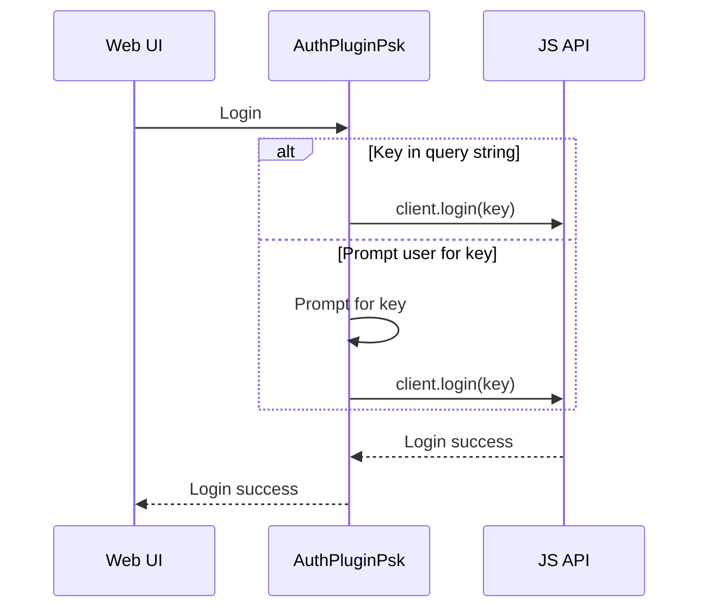
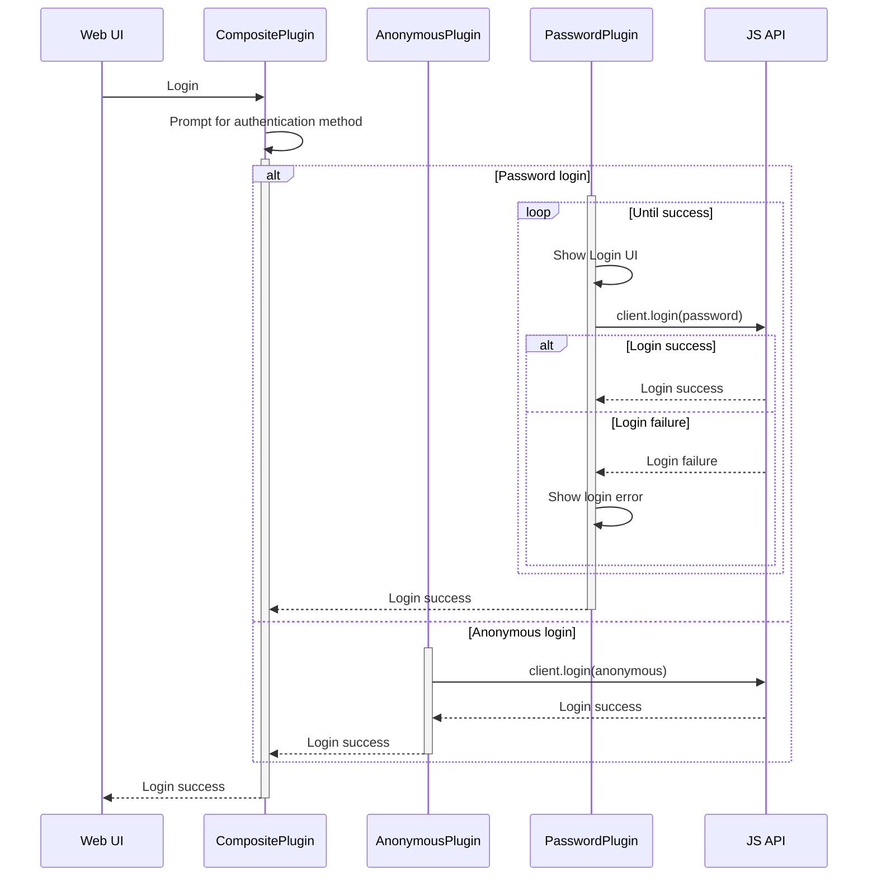
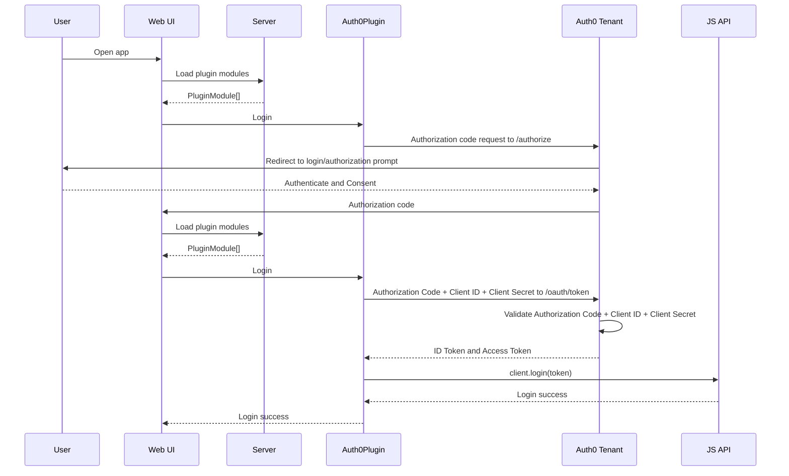

# @deephaven/auth-plugins

Authentication plugins for Deephaven. Used by [AuthBootstrap](../app-utils/src/components/AuthBootstrap.tsx) to provide default authentication if no custom plugins are loaded. For mode details on custom plugins, see [deephaven-js-plugins repository](https://github.com/deephaven/deephaven-js-plugins).

## Install

```bash
npm install --save @deephaven/auth-plugins
```

## Developing New Auth Plugins

Export an `AuthPlugin` from a module to register an authentication plugin. Authentication plugins must implement the [AuthPlugin interface](./src/AuthPlugin.ts#L32). Authentication plugins can display a UI which then triggers how to login.

The Web UI loads all plugins on initialization, and uses the first available authentication plugin for authenticating. A sequence diagram of this flow at a high level, where `AuthPlugin` is the first authentication plugin that is available.



## Examples

Below are some sequence diagrams for some of the included Auth Plugins.

#### Pre-shared Key ([AuthPluginPsk](./src/AuthPluginPsk.tsx))



### Composite Password/Anonymous plugin

Composite plugin giving the user the choice of logging in with a password or logging in anonymously



#### Auth0

Translation of flow from https://auth0.com/docs/get-started/authentication-and-authorization-flow/authorization-code-flow, showing which responsibilities login plugin handles. Note that the plugins need to be loaded initially prior to redirecting to the authorization prompt, and then again after redirecting back to the Web UI. For a specific example using Keycloak, see [AuthPluginKeycloak](https://github.com/deephaven/deephaven-js-plugins/tree/main/plugins/auth-keycloak).



# Legal Notices

Deephaven Data Labs and any contributors grant you a license to the content of this repository under the Apache 2.0 License, see the [LICENSE](../../LICENSE) file.
